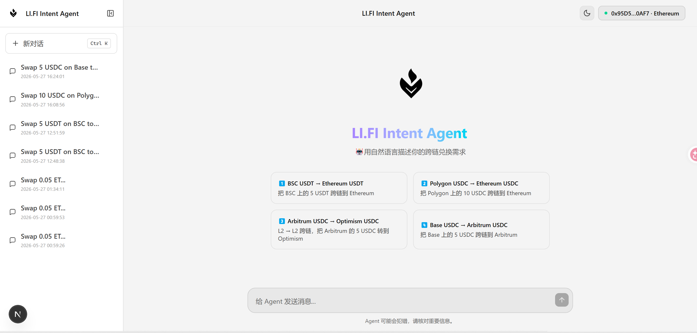
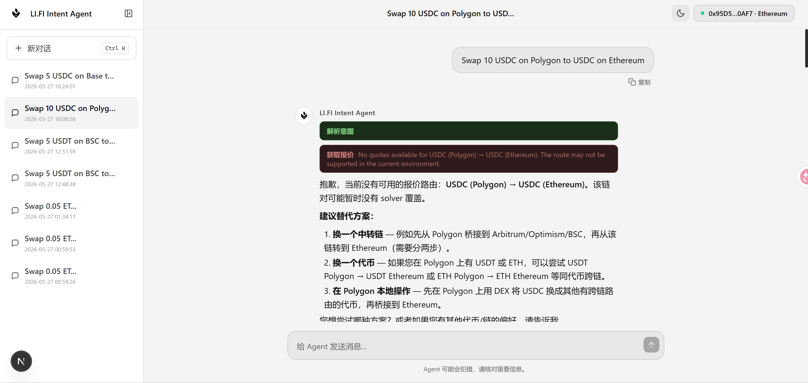
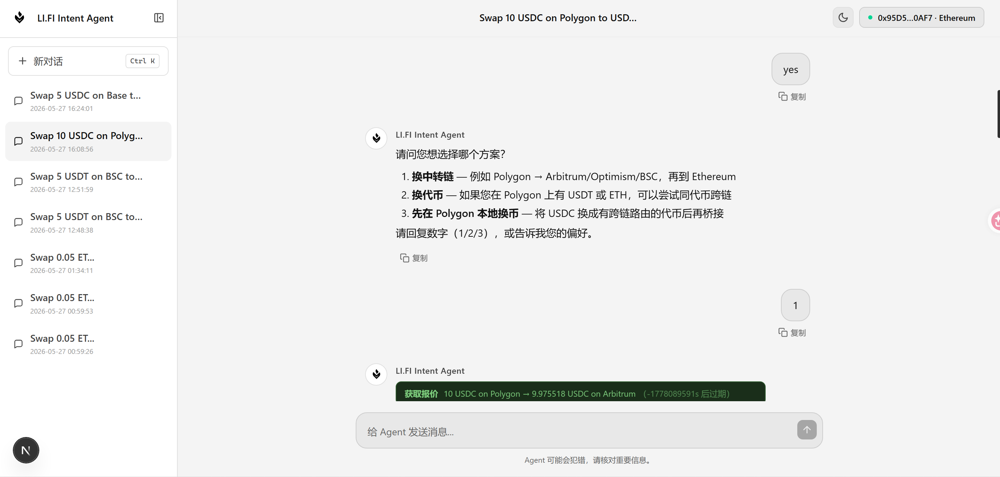
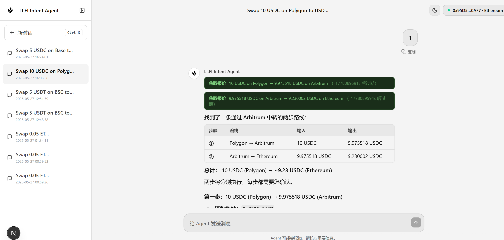
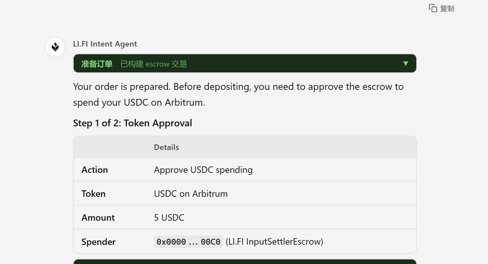
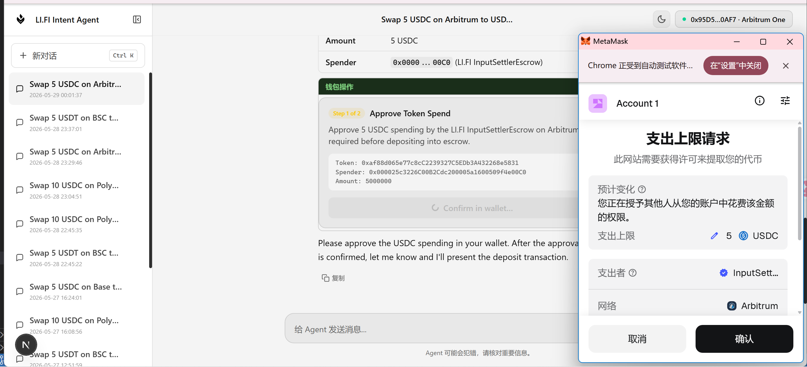

<div align="center">


# LI.FI Intent Agent

**🏆 Hackathon Project — An AI agent that turns plain-language cross-chain swap requests into fully executed on-chain intents via the LI.FI Solver Marketplace.**

[](https://docs.li.fi/lifi-intents/introduction)
[](https://lifi-intent-slover-agent-nbt95rhaa-3343759238-qqcoms-projects.vercel.app/)
[](https://nextjs.org/)
[](https://ai-sdk.dev/)
[](https://docs.li.fi/lifi-intents/introduction)
[](https://wagmi.sh/)

[English](#english) · [中文](#中文)

</div>

---

## English

### Overview

**LI.FI Intent Agent** is a hackathon project that bridges natural language and on-chain cross-chain transfers. Built with the [Vercel AI SDK](https://ai-sdk.dev/) tool-loop agent pattern, it lets you describe a swap in plain English or Chinese — the agent parses your intent, routes it through the [LI.FI Intent/Solver Marketplace](https://docs.li.fi/lifi-intents/introduction), fetches a live quote, and guides you through every wallet step needed to complete the cross-chain transfer end-to-end.

The AI SDK `streamText` tool-loop drives the entire reasoning pipeline. Each turn the model autonomously decides which tool to call next (`requestQuote → prepareOrder → planWalletAction → submitOrder → trackOrder`), with Zod schemas enforcing type safety at every boundary. The escrow open transaction is constructed client-side from the quote — no undocumented API calls.

---

### Screenshots

| Home — quick swap suggestions | Unsupported route — smart alternatives |
|---|---|
|  |  |

| Multi-hop plan — quote via relay chain | Two-step route table (Polygon → Arbitrum → Ethereum) |
|---|---|
|  |  |

| Order prepared — escrow tx built | MetaMask approval popup triggered |
|---|---|
|  |  |

---

### Features

- **Natural language interface** — describe swaps like "Swap 5 USDC on Arbitrum to Optimism" and the agent handles the rest
- **Smart quote routing** — fetches live quotes from LI.FI Intents solvers; surfaces multi-hop alternatives (e.g. Polygon → Arbitrum → Ethereum) when a direct route has no solver inventory
- **Full on-chain execution** — builds `InputSettlerEscrow.open()` calldata locally from the quote, requests ERC-20 approval if needed, then sends the escrow deposit — all guided step by step
- **Auto chain switching** — detects wallet chain mismatch and prompts a one-click network switch before approval or deposit
- **Collapsible tool output cards** — tool calls (quote, prepare order, wallet action, track order) render as compact pill badges; expand to view full JSON
- **Order tracking** — polls `/orders/status` and shows live status (⏳ Signed → 🔄 Delivered → ✅ Settled) with a one-click refresh button
- **Session history** — sidebar lists all past conversations with auto-generated titles; click the logo to start a new session
- **Wallet connection** — connect any EVM wallet via Reown AppKit (MetaMask, WalletConnect, Coinbase Wallet, etc.)
- **Dark / Light theme** — system-aware, toggle in header
- **Copy to clipboard** — one-click copy on every message bubble

---

### Supported Routes (Solver Inventory)

LI.FI Intents solvers support **same-token cross-chain transfers** only. Most reliable pairs:

| From | To | Max Liquidity | Recommended |
|---|---|---|---|
| Base USDC | Arbitrum USDC | ~71,265 USDC | ⭐ Best |
| Polygon USDC | Ethereum USDC | ~47,500 USDC | ⭐ Good |
| Arbitrum USDC | Optimism USDC | ~1,978 USDC | ✓ |
| BSC USDT | Ethereum USDT | ~3.4 USDT | Small |

> Cross-token cross-chain swaps (e.g. USDT → USDC) are not directly supported. The agent will propose two-step workarounds automatically.

---

### Tech Stack

| Layer | Technology |
|---|---|
| Framework | Next.js 16 (App Router) |
| AI Agent | [Vercel AI SDK](https://ai-sdk.dev/) v6 — `ToolLoopAgent`, streaming, Zod tool schemas |
| LLM | OpenAI-compatible providers — Alibaba Qwen, OpenAI, or any compatible model |
| Cross-chain | LI.FI Intents API (`order.li.fi`) |
| Wallet | Reown AppKit + wagmi v3 + viem |
| Styling | TailwindCSS v4 |
| Markdown | react-markdown + remark-gfm |
| Storage | localStorage (session history) |

---

### Quick Start

#### 1. Clone & Install

```bash
git clone <repo-url>
cd lifi-intent-slover
npm install
```

#### 2. Configure Environment

Copy the example env file and fill in your keys:

```bash
cp .env.local.example .env.local
```

| Variable | Description | Example |
|---|---|---|
| `AI_PROVIDER_BASE_URL` | OpenAI-compatible API base URL | `https://dashscope.aliyuncs.com/compatible-mode/v1` |
| `AI_PROVIDER_API_KEY` | LLM API key (server-side only, never expose to browser) | `sk-xxx` |
| `AI_PROVIDER_MODEL` | Model name | `qwen-plus` |
| `LIFI_INTENTS_BASE_URL` | LI.FI Intents API base URL | `https://order.li.fi` (production) |
| `LIFI_SOLVER_API_KEY` | LI.FI solver API key (optional) | — |
| `NEXT_PUBLIC_REOWN_PROJECT_ID` | Reown AppKit project ID (get from [cloud.reown.com](https://cloud.reown.com)) | `abc123...` |

> **Security:** `AI_PROVIDER_API_KEY` is used server-side only. Never prefix it with `NEXT_PUBLIC_`.

> **Environment:** Omit `LIFI_INTENTS_BASE_URL` to default to the dev environment (`order-dev.li.fi`). Set it to `https://order.li.fi` for production.

#### 3. Run Development Server

```bash
npm run dev
```

Open [http://localhost:3000](http://localhost:3000).

---

### Project Structure

```
app/
  api/chat/             # Streaming chat API route — AI agent backend
components/
  agent/                # AgentMessage, ToolCallCard, WalletActionCard
  ai-studio-chat.tsx    # Chat input, session management
lib/
  agents/               # Agent definition, system prompt
  lifi/
    rest-client.ts      # LI.FI Intents REST client
    contracts.ts        # InputSettlerEscrow ABI + StandardOrder encoding
    chains-config.ts    # Supported chains, known tokens, NATIVE_SENTINEL
    token-resolver.ts   # Token address → symbol lookup
    schemas.ts          # Zod input schemas for all tools
    types.ts            # WalletAction, LifiQuoteSummary, SubmittedOrder …
  tools/
    lifi-quote-tool.ts          # requestQuote
    lifi-prepare-order-tool.ts  # prepareOrder (builds escrow open tx)
    wallet-action-tool.ts       # planWalletAction
    lifi-submit-order-tool.ts   # submitOrder
    lifi-track-order-tool.ts    # trackOrder
  wallet/               # ERC-20 ABI helpers
  storage/              # localStorage session persistence
```

---

### Session Storage

All conversation history is stored **entirely in your browser's `localStorage`** — no data is sent to any server.

| What is stored | Details |
|---|---|
| Session list | All conversation titles and IDs |
| Message history | Full message content including tool outputs |
| Active session | Last viewed session ID |

**How to delete:**

| Method | Steps |
|---|---|
| Delete a single conversation | Hover over a session in the sidebar → click the 🗑 icon → confirm |
| Clear all conversations | Open DevTools → Application → Local Storage → `http://localhost:3000` → right-click → Clear |
| Clear from the browser | Browser Settings → Privacy → Clear browsing data → Cached / Site Data |

> **Privacy note:** Wallet addresses and quote data are stored as part of message history. Clearing localStorage removes everything permanently.

---

### Reference

- [LI.FI Intents Introduction](https://docs.li.fi/lifi-intents/introduction)
- [LI.FI Intents MCP Server](https://docs.li.fi/lifi-intents/mcp-server/overview)
- [AI SDK Agents](https://ai-sdk.dev/docs/agents/overview)
- [Next.js Docs](https://nextjs.org/docs)
- [Reown AppKit](https://docs.reown.com/)
- [wagmi](https://docs.wagmi.com/wagmi)
- [viem](https://viem.sh/docs/getting-started)

---

## 中文

### 项目简介

**LI.FI Intent Agent** 是一个黑客松项目，将自然语言与链上跨链转账端到端打通。基于 [Vercel AI SDK](https://ai-sdk.dev/) 的工具循环模式构建：你只需用中文或英文描述兑换需求，Agent 自动解析意图、通过 [LI.FI Intent/Solver 市场](https://docs.li.fi/lifi-intents/introduction)获取实时报价，并引导你完成每一步链上钱包操作，直到跨链转账完成。

AI SDK `streamText` 工具循环驱动整个推理流水线：每一轮模型自主决定下一步调用哪个工具（`requestQuote → prepareOrder → planWalletAction → submitOrder → trackOrder`），Zod schema 在每个边界强制类型安全。Escrow open 交易从报价数据在客户端本地构建，无需调用任何未公开 API。

---

### 截图预览

| 首页 — 快捷操作卡片 | 不支持路由 — 智能替代方案 |
|---|---|
|  |  |

| 多跳方案 — 经中继链报价 | 两步路由表格（Polygon → Arbitrum → Ethereum） |
|---|---|
|  |  |

| 订单已准备 — Escrow 交易已构建 | MetaMask 授权弹窗触发 |
|---|---|
|  |  |

---

### 主要功能

- **自然语言输入** — 用对话描述需求，如"把 Arbitrum 上的 5 USDC 桥接到 Optimism"
- **智能报价路由** — 实时从 LI.FI Intents solver 网络获取报价；当直接路由暂无 solver 时，自动规划多跳替代路线（如 Polygon → Arbitrum → Ethereum）
- **链上全流程执行** — 本地从报价构建 `InputSettlerEscrow.open()` calldata，按需请求 ERC-20 授权，再发送 escrow 存款交易，全程分步引导
- **自动切链** — 检测钱包链不匹配时，一键提示切换到目标网络，再执行授权或存款
- **可折叠工具输出卡片** — 报价、准备订单、钱包操作、追踪订单均以紧凑卡片展示，点击展开查看完整 JSON
- **订单追踪** — 轮询 `/orders/status`，实时显示状态（⏳ Signed → 🔄 Delivered → ✅ Settled），支持一键刷新
- **会话历史** — 侧边栏列出所有历史对话，自动生成标题；点击 logo 开启新会话
- **钱包连接** — 支持通过 Reown AppKit 连接任意 EVM 钱包（MetaMask、WalletConnect、Coinbase 等）
- **明暗主题** — 跟随系统偏好，可在顶栏手动切换
- **一键复制** — 每条消息气泡下方有复制按钮

---

### 支持路由（Solver 库存）

LI.FI Intents solver 网络仅支持**相同代币的跨链转账**。最可靠路由：

| 源链 | 目标链 | Solver 最大库存 | 推荐度 |
|---|---|---|---|
| Base USDC | Arbitrum USDC | ~71,265 USDC | ⭐ 最佳 |
| Polygon USDC | Ethereum USDC | ~47,500 USDC | ⭐ 良好 |
| Arbitrum USDC | Optimism USDC | ~1,978 USDC | ✓ |
| BSC USDT | Ethereum USDT | ~3.4 USDT | 库存较浅 |

> 跨代币跨链（如 USDT → USDC）不被直接支持，Agent 会自动提出两步替代方案。

---

### 技术栈

| 层 | 技术 |
|---|---|
| 框架 | Next.js 16（App Router） |
| AI Agent | [Vercel AI SDK](https://ai-sdk.dev/) v6 — `ToolLoopAgent`、流式输出、Zod 工具 schema |
| LLM | OpenAI 兼容接口 — 阿里云 Qwen、OpenAI 或任意兼容模型 |
| 跨链协议 | LI.FI Intents API（`order.li.fi`） |
| 钱包 | Reown AppKit + wagmi v3 + viem |
| 样式 | TailwindCSS v4 |
| Markdown | react-markdown + remark-gfm |
| 存储 | localStorage（会话持久化） |

---

### 快速开始

#### 1. 克隆项目 & 安装依赖

```bash
git clone <repo-url>
cd lifi-intent-slover
npm install
```

#### 2. 配置环境变量

复制示例文件并填写配置：

```bash
cp .env.local.example .env.local
```

| 变量 | 说明 | 示例 |
|---|---|---|
| `AI_PROVIDER_BASE_URL` | OpenAI 兼容接口地址 | `https://dashscope.aliyuncs.com/compatible-mode/v1` |
| `AI_PROVIDER_API_KEY` | LLM API 密钥（仅服务端，不可暴露到浏览器） | `sk-xxx` |
| `AI_PROVIDER_MODEL` | 模型名称 | `qwen-plus` |
| `LIFI_INTENTS_BASE_URL` | LI.FI Intents API 地址 | `https://order.li.fi`（生产环境） |
| `LIFI_SOLVER_API_KEY` | LI.FI Solver API 密钥（可选） | — |
| `NEXT_PUBLIC_REOWN_PROJECT_ID` | Reown AppKit 项目 ID（在 [cloud.reown.com](https://cloud.reown.com) 注册获取） | `abc123...` |

> **安全提示：** `AI_PROVIDER_API_KEY` 仅用于服务端，**绝不能**加 `NEXT_PUBLIC_` 前缀。

> **环境切换：** 不设置 `LIFI_INTENTS_BASE_URL` 默认使用开发环境（`order-dev.li.fi`），设为 `https://order.li.fi` 使用生产环境。

#### 3. 启动开发服务器

```bash
npm run dev
```

访问 [http://localhost:3000](http://localhost:3000)。

---

### 目录结构

```
app/
  api/chat/             # 流式聊天 API 路由（AI Agent 后端）
components/
  agent/                # AgentMessage、ToolCallCard、WalletActionCard
  ai-studio-chat.tsx    # 聊天输入、会话管理
lib/
  agents/               # Agent 定义、系统提示词
  lifi/
    rest-client.ts      # LI.FI Intents REST 客户端
    contracts.ts        # InputSettlerEscrow ABI + StandardOrder 编码
    chains-config.ts    # 支持链、已知代币、NATIVE_SENTINEL
    token-resolver.ts   # 代币地址 → symbol 查找
    schemas.ts          # 所有工具的 Zod 输入 schema
    types.ts            # WalletAction、LifiQuoteSummary、SubmittedOrder …
  tools/
    lifi-quote-tool.ts          # requestQuote
    lifi-prepare-order-tool.ts  # prepareOrder（本地构建 escrow open tx）
    wallet-action-tool.ts       # planWalletAction
    lifi-submit-order-tool.ts   # submitOrder
    lifi-track-order-tool.ts    # trackOrder
  wallet/               # ERC-20 ABI 辅助
  storage/              # localStorage 会话持久化
```

---

### 会话存储规则

所有历史对话完全存储在你的浏览器 **`localStorage`** 中，不会上传到任何服务器。

| 存储内容 | 说明 |
|---|---|
| 会话列表 | 所有对话的标题和 ID |
| 消息内容 | 完整的聊天记录，包含工具输出 |
| 当前会话 | 最后打开的对话 ID |

**如何删除：**

| 方式 | 操作步骤 |
|---|---|
| 删除单条对话 | 在侧边栏悬停对话条目 → 点击 🗑 图标 → 点确认 |
| 清除全部对话 | 打开 DevTools → Application → Local Storage → 当前地址 → 右键 → Clear |
| 浏览器清除 | 浏览器设置 → 隐私与安全 → 清除浏览数据 → 勾选 「Cached 数据 / 站点数据」 |

> **隐私提示：** 钱包地址和报价数据作为消息内容的一部分会被存储。清除 localStorage 将永久删除所有记录。

---

### 参考资料

- [LI.FI Intents 介绍](https://docs.li.fi/lifi-intents/introduction)
- [LI.FI Intents MCP Server](https://docs.li.fi/lifi-intents/mcp-server/overview)
- [AI SDK Agents 文档](https://ai-sdk.dev/docs/agents/overview)
- [Next.js 文档](https://nextjs.org/docs)
- [Reown AppKit 文档](https://docs.reown.com/)
- [wagmi 文档](https://docs.wagmi.com/wagmi)
- [viem 文档](https://viem.sh/docs/getting-started)
